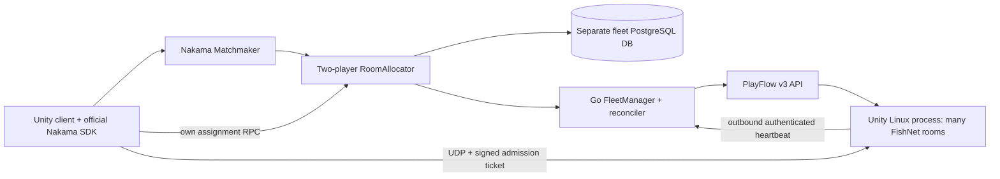

# Architecture and implementation scope

## Control and gameplay boundaries



`FleetManager` owns physical processes. `RoomAllocator` owns room reservations. A matchmaker pair is not automatically a new cloud instance. This distinction permits multiple two-player game rooms to share a process.

All six standard FleetManager methods are implemented. `Create` accepts an even physical capacity up to the profile maximum and zero or two initial users; an optional initial room has priority on that worker. `Join` accepts exactly the room's two users plus `metadata["allocation_id"]`; it atomically reserves both seats after preparation. This profile intentionally has narrower game semantics than a generic arbitrary-player allocator.

`List` uses a JSON query with optional `state` and `region`, a limit of 1–100 and an opaque keyset cursor. `Update` accepts a bounded aggregate player count and no arbitrary metadata; the authenticated agent owns runtime observations. `Delete` rejects occupied/busy resources and initiates a graceful drain. Destructive force deletion is not a public client feature.

The included matched hook requires exactly two users, `string_properties.build_hash` and `string_properties.region` matching the configured pool. It creates a durable allocation and returns no Nakama authoritative match ID. The client uses the matched event as a signal to query `fleet_assignment_get_v1`; it must not call `JoinMatchAsync` for this external battle room. Existing hooks need explicit composition in the same Go runtime.

## Durable state and transitions

Initial storage uses **one JSONB row per namespace**, serialized by PostgreSQL `SELECT ... FOR UPDATE`. This is a deliberate first-version tradeoff: atomic user admission, command ACKs and room counts are straightforward to verify. It is not the normalized, independently indexed high-throughput schema from the longer-term design.

The row contains worker identity, provider identity, boot identity, endpoint, room capacity, metrics, allocations, reservations, command outbox, notification revision and controller lease. It never stores PlayFlow API keys, bootstrap tokens, agent tokens or admission signing keys. These are derived in memory from a server-side master key and worker/boot identity.

No provider network request occurs while holding the database transaction. Transactions preserve all-or-nothing behavior for failed reservations and invalid heartbeat batches. A fixed namespace fingerprint rejects build/region/provider-build/capacity/port/compute/signing-key drift between controllers. Backup and protect the fleet DB independently from Nakama's own schema.

```text
worker: requested → starting → launching → bootstrapping → ready
        starting → unknown → reconcile/adopt launching
        ready → suspect → ready OR lost (quarantined)
        ready → draining → stopping → stopped

room:   waiting_capacity → preparing → prepared → assigned → active → completed
        any unfinished allocation → cancelling → cancelled/expired after cleanup ACK
        authoritative worker loss/stop → failed
```

A successful preparation ACK normally reserves the two seats in the same transaction. The temporary `prepared` state is retained only if the worker is not currently eligible for admission. Host readiness and a valid public UDP endpoint are both required; provider `running` alone is insufficient.

Cancellation withdraws undispatched preparations and sends an idempotent `cancel_room`. Capacity remains occupied until cleanup is acknowledged. The Unity side additionally records room/allocation/epoch cancellation tombstones, protecting against an already-in-flight older prepare command. A failed cleanup command gets a new execution ID after bounded backoff; retransmitting the same ID only retrieves its prior outcome.

Heartbeats contain a complete bounded snapshot of local rooms and actual connected user IDs. Missing observations never automatically release rooms. Hosts retain a `closed` room until the exact snapshot is acknowledged, and count that observation against local capacity until then. A two-player room is promoted to `active` only after a playing report includes both players.

Completed allocations are retained for a day, acknowledged commands for an hour after their expiry, and unreferenced stopped/definitely-failed workers for a day. Unresolved creates and lost cloud resources remain counted and visible. The initial store has a 16 MiB row guard; monitor state growth and migrate to normalized tables before a large deployment.

## Controller ownership and recovery

PostgreSQL serializes admission across controllers. A 30-second owner lease gates provider reconciliation; a process rechecks and renews it before external work. One oldest-due provider operation is attempted per tick, with bounded network timeouts, keeping provider failure from creating an unbounded IO backlog inside one tick. Preparation ACKs reserve seats immediately, independently of this slower loop.

These database locks do not add clustering or cross-node matchmaker behavior to Nakama itself. Any multi-node deployment still needs the appropriate Nakama-supported session routing, matching and notification configuration.

An interrupted or uncertain POST is marked `unknown` and reconciled by `custom_data.fleet_owner` plus `worker_id`. An absent list result is never treated as proof that creation failed; it remains counted against maximum instances. Multiple matches require operator investigation. Definite provider configuration/authentication errors pause new creates until configuration is corrected and an authenticated operator calls `retry-creation`.

Nakama restarts do not erase allocations or agent boot identity. The agent retries the exact same heartbeat sequence/body until acknowledged. Commands and assignment revisions recover from the database. Standard `Create` callback functions are process-local and cannot survive a crash; the durable assignment query is the recovery mechanism. Each node may deliver its own callbacks while only the lease owner reconciles the provider.

Short control loss makes a mature worker suspect and blocks new assignments. It never reapplies the startup deadline to an already mature instance. Loss beyond 60 seconds fails associated allocations and quarantines the instance without blindly deleting it. A confirmed provider stop/404 ends allocations and releases accounting; an ownership mismatch instead fences allocations and keeps the foreign resource quarantined.

Loss quarantine is deliberately conservative. Initial admin routes do not include arbitrary adoption, forced stop or removal of quarantined records; operator recovery requires verifying the provider state first. Orphan discovery across every namespace/account and a dedicated repair UI are future work.

## Admission and server responsibilities

The client receives only its own host/port, room, allocation, seat and HMAC ticket. Claims bind schema version, Nakama user ID, worker ID, boot ID, room ID, allocation ID, reservation ID, seat, epoch, expiry, nonce and resume flag. The verifier must authenticate the payload before trusting claims, enforce expiry and single-use nonce, then check local roster/seat/epoch and connection ownership.

Nakama login tokens, PlayFlow API keys and server signing secrets must never be used as public battle-server credentials. The bootstrap token is scoped to a worker; bootstrap repeats with the same boot ID are safe, but a different process boot cannot inherit the previous room assignments. Automatic provider process restart is disabled in the start request; game-process crash recovery is not implemented by this plugin.

New tickets last at most 60 seconds. A disconnect grants the existing seat a 90-second reconnect window, and a resume RPC issues a fresh token valid for at most 45 seconds and never beyond that window. The game host must also enforce the window locally; signature verification does not implement transport connection replacement. Initial result/audit persistence is a host obligation, not a backend settlement service supplied here.

Administrative and agent routes implement their own authentication because custom Nakama HTTP handlers do not automatically inherit user RPC authentication. Production requires HTTPS, external rate/connection limits, secret injection, and access restrictions for admin endpoints. Runtime RPCs require a Nakama user session. No game client can request arbitrary PlayFlow starts/deletes through the exposed RPC set.

## Capacity policy

The first policy supports one fixed build/region pool, two-player rooms, bin packing and bounded reactive scaling:

| Decision | Current rule |
| --- | --- |
| Room placement | Most occupied eligible worker with a free room; preferred Create room first |
| Ready for placement | Agent ready, heartbeat no older than 8s, correct build/region, valid endpoint, not draining |
| Load gate | Oldest simulation queue age ≤2s and reported main-thread frame P99 ≤100ms |
| Scale out | Unbound room demand exceeds capacity already booting, or fewer than `MIN_INSTANCES` are ready |
| Cost ceiling | All possibly billable workers, including unknown/lost, count toward `MAX_INSTANCES` |
| Scale in | Empty for `FLEET_IDLE_SECONDS` (default600), above minimum, and no unmatched room demand |
| Final stop | Drain acknowledged, zero occupied rooms/players, fresh heartbeat, zero simulation/audit/pending-result work |
| Provider TTL | Record the provider's absolute expiry; stop admissions and start drain with `FLEET_MIN_LIFETIME_FOR_ADMISSION_SECONDS` remaining (default1800s) |

The 2s/100ms gates are initial defaults, **not game performance guarantees**. Numeric gates are available on Go `Config`; only the environment values listed in the deployment template are exposed for the standalone module. `FLEET_MAX_ROOMS` must also be enforced by the local game host. The default sample two-room capacity demonstrates scheduling, not a measured recommendation.

Measure the actual PlayFlow Linux build: simultaneous simulation bursts, realistic player activity, simulation P95/P99, queue age, main-thread frame P99, total RSS, replay/audit backlog and result-upload latency. Set a hard room cap below the first quality boundary. Reserve CPU headroom for audit/result bursts; a process can have idle connected players while its simulation queue is saturated.

The start request omits a requested TTL, but a provider plan can still impose one. PlayFlow's [API documentation](https://docs.playflowcloud.com/api-reference/introduction) currently describes a forced one-hour lifetime on its free plan. The allocator records returned TTL and startup time (falling back conservatively to request time), and drains before that deadline. A provider lifetime too short for startup plus the admission margin pauses further creates rather than repeatedly launching unusable instances. The chosen margin must cover the game's **maximum entire room lifetime**, reconnect and durable flush; average match length is insufficient. The game must enforce that bound and limit rematches. This plugin cannot prevent a provider-enforced kill after the deadline.

`MIN_INSTANCES` is a lower bound on ready instance count, not a free-slot guarantee. Initial scale out reacts to queued rooms and counts booting capacity; it has no arrival-rate forecasting, percentile-based headroom, cold-start model, native pool claiming, multi-region routing, multi-build rollout or cloud-budget currency accounting. These are explicit next-stage policy extensions, not latent capabilities of FleetManager itself.

## Next implementation stages

1. Implement and test the game Host adapter, official Nakama client bridge and FishNet connection authentication with the actual game. See the [game integration checklist](game-integration.md).
2. Add durable result/replay upload ownership and settlement idempotency before enabling automatic scale-in for ranked games.
3. Validate real PlayFlow schema/permissions/ports/launch readiness, cold boot, reconnect and drain on a small staging cap.
4. Run target-machine pressure tests and set per-build capacity/gates, minimum warm capacity and scaling hysteresis.
5. Normalize the store, improve provider work concurrency/queue telemetry, add operator recovery, multi-build routing and deployment compatibility migrations as scale requires.

The production capabilities listed above remain a roadmap. This repository supplies the executable control-plane foundation and integration contracts; successful mock tests do not fulfill steps 1–5.
